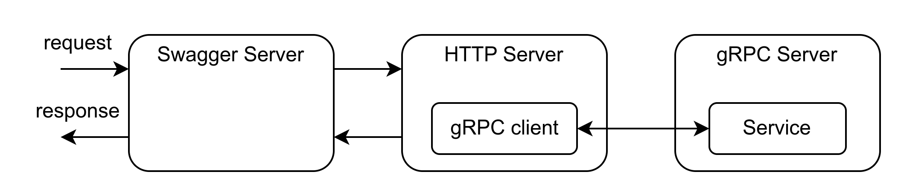

# architect

Architect is a tool for creating web applications on Golang on the fly. It consists of two parts: 
1. The CLI part generates sceleton of future microservice, helps with its architecture and simplifies work with infra parts. 
2. The framework part runs microservices based on the architect and provides some connection with infra.

Many things in development bond with your team or organizations, e.g. using gitlab, linters, internal architecture and other stuff. You can suggest some changes or feel free to fork this tool and change templates in internal/cli/templates folder for your goals. 

## Goals 
- Simplify microservice development.
- Speed up developmnet.
- Unify internal architecture of all Golang applications.
- Move all infra from app so that developers can focus only on logic.
- Automate routine product developer work. 

## Requirements

Now the architect is available only for MacOS & Linux. 

You need to install Golang to use the architect. Instructions you can find [here](https://go.dev/doc/install). 

## Installation

To install or update `architect` use the `go install` command:

```bash
go install gitlab.com/zigal0/architect/cmd/architect@latest
```

## CLI part

The main goal of the CLI part of the architect is design and build your microservice. It includes initialization from scratch and other commands to add components in your project such as grpc-client, repository etc. 

Architect as a CLI has next commands:
```
add         Base for other add sub commands
    grpc-client     Add code for connect and interact with given client via gRPC
    manager         Add new manager, top logic entity, with given name
    proto-service   Add proto contract for new service with given name
    repository      Add new repository with given name
    sub-manager     Add new sub manager, lower logic entity, with given name

completion  Generate the autocompletion script for the specified 
    bash            Generate the autocompletion script for bash
    fish            Generate the autocompletion script for fish
    powershell      Generate the autocompletion script for powershell
    zsh             Generate the autocompletion script for zsh

generate    Base for other generate sub commands
    services        Generate services based on given name

help        Help about any command

init        Initialize architect application

show        Base for other show sub commands
    architecture    Show architecture of the architect based application
```

Final architecture of microservice based on architect: 
```
├── api # proto contracts
│   ├── some_name_service # for one gRPC service
│   │   └── service.proto
│   └── types # entities that used in some proto files services
│       └── types.proto
├── bin # for local binaries (in .gitignore)
│   └── ...
├── cmd # run entry points
│   ├── helper # entry for developer needs
│   │   └── ...
│   └── project # entry for app
│       └── main.go
├── config # env settings for app run
│   ├── config.go
│   ├── local_example.env
│   ├── prod.env
│   └── stg.env
├── internal # internal code of app
│   ├── adapter # external entities to work with data 
│   │   ├── client # other microservices
│   │   │   ├──some_app_name
│   │   │   │   ├── client.go
│   │   │   │   └── some_method.go
│   │   │   └── provider.go
│   │   └── repository # db
│   │       └── some
│   │           ├── model.go
│   │           ├── repository.go
│   │           ├── some_method.go
│   │           └── sql.go
│   ├── api # handlers
│   │   ├── some_name_service_impl
│   │   │   ├── interface.go
│   │   │   ├── mapper.go
│   │   │   ├── service.go
│   │   │   └── some_handler.go
│   │   └── mapper.go
│   ├── business # logic
│   │   ├── manager # top logic element
│   │   │   └── some
│   │   │       ├── error.go
│   │   │       ├── interface.go
│   │   │       ├── manager.go
│   │   │       ├── some_method.go
│   │   │       └── testing_test.go
│   │   ├── sub_manager # lower logic element (code used in some managers)
│   │   │   └── some # same files as manager
│   │   │       └── ...
│   │   └── tool # different tools used in many places (future libs)
│   │       └── ...
│   ├── domain # entities in app 
│   │   └── ...
│   ├── generated # auto generated code (DO NOT EDIT)
│   │   ├── api # code for api of app
│   │   │   └── ...
│   │   ├── client # code for api of other apps
│   │   │   └── ...
│   │   └── swagger # dirty hack (will removed)
│   │       └── ...
│   └── init # init functions for main, (e.g. db)
│       └── ...
├── local # for local development
│   ├── docker # components for run
│   │   └── ...
│   └── example # commands, queries for developers
│       └── ...
├── migration # db migrations
│   └── ...
├── tests # integration tests (run with running app)
│   └── ...
├── script # developer scripts
│   └── ...
├── vendor.protogen # vendor for proto (in .gitignore)
│   └── ...
├── .gitattributes # customization of action with git (e.g. diff)
├── .gitignore # list of ignore dirs & files
├── .gitlab-ci.yml # pipeline for gitlab
├── .golangci.yaml # linter configuration
├── Makefile # app make targets
├── Dockerfile # dockerfile to deploy app
├── go.mod # dependencies of app
├── go.sum # checksums for go dependencies
├── protodep.lock # checksums for proto vendoring (in .gitignore)
├── protodep.toml # config for proto vendoring
├── README.md # description of app
└── architect.mk # common make targets (DO NOT EDIT)
```

## Framework part

The main goal of the framework part is to run microservices based on the architect and reduce some routine work of product developers. 

The most valuable piece is that the architect takes the responsibility for work with the API layer. All that developers need is to define contracts on Protocol Buffer and write some code for mapping domain structures to API (pb). Architect builds all code to work with the next bunch: gRPC, REST & Swagger. 

Schema of gRPC + REST + Swagger:


### Components of framework: 
- Closer - inteface for correct closes all connections that were open during app run. 
- business_error - tool for work with errors in the business layer. It solves problems with text errors and other stuff such as codes due to gRPC use.
- logger - tool based on [zap](https://github.com/uber-go/zap) logger. It provides a nice interface for logging and unifies settings across architect-microservices. 

### Some other stuff 
- Availble to add custom interceptors for gRPC handlers, you can specify them in Init() func. All http request as well use them. However only for http no.
- Correct work with CORS. You can modify settings in Init() func. 

## Future work 

### Command scratches
* ```add grpc-client``` - need to be improved. Generate pb code, close with local interface for test. 
* ```add http-client``` - need to add. Many other services communicate only via http.
* ```add postgres``` - adds code for connection to postgres, and part in docker-compose for local development (commands in Makefile).
* ```add 'other dbs'``` - add commands for other dbs for require.
* ```add repository``` - many cases of errors with work in this layer. Need to add code for testing.
* ```add logic-component 'name'``` - consider adding other logic components.
* ```add kafka-consumer (producer)``` - add code for work with (consumer/producer) kafka message broker. Need to think more.
* ```add rabbitmq-consumer (producer)``` - consider work with RabbitMQ.
* ```add cron``` - add base code for cron.
* ```add integration-tests``` - add code for integration test for your application.
* ```generate services``` - need to be deleted after implementing own protoc plugin for generating gRPC service implementation.
* ```generate config``` - generate Go config for abstract work with envs and other config files. 
* ```upgrade``` - upgrades local architect bin.
* ```update``` - updates architect in your project (now only manually).
* ```version``` - show version of architect.
* ```check``` - checks for architect requirements (e.g. Go version).


### Issues
- Move from env to yaml config ([viper](https://github.com/rakyll/statik)).
- Move swagger from apps to architect ([statik](https://github.com/rakyll/statik)).
- Write own protoc plugin to generate service layer. Then delete the dirty hack for gRPC services. 
- Move from latest to specific versions of deps.
- Keep records every CHANGELOG (separate feature merge request before release).
- Generate config from values.yaml files. 
- Update existing files, not recreate them. 
- Docker (with add commands or separate).
- Kafka/RabbitMQ - to the adapter layer.
- Interactive mode.
- Change work with proto deps - now it's a little bit complicated (buf is a choice, but not in Russia).
- Check the build of the new application.
- Support for windows & macOS
- Short flag for command show architecture.
- Add work with metrics.
- Add work with flags (ports & etc).
- Add work with http middlewares. Now it is only for gRPC.
- Speed up the generating process and reduce logs.  
